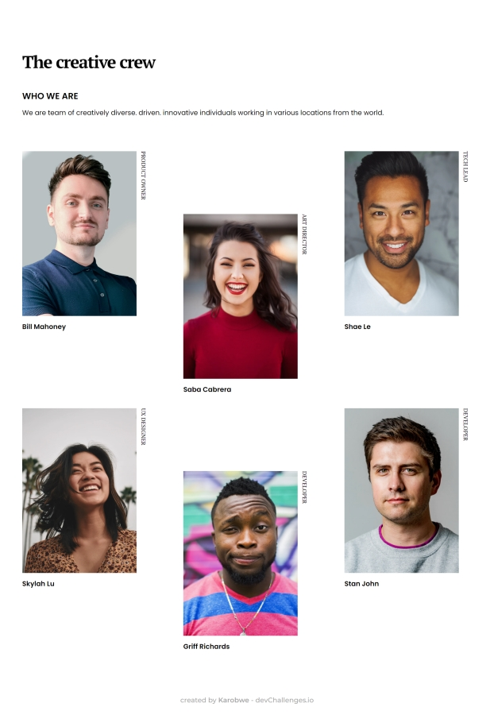

<!-- Please update value in the {}  -->

<h1 align="center">My team page</h1>

   Solution for a challenge from  <a href="http://devchallenges.io" target="_blank">Devchallenges.io</a>.

  <h3>
    <a href="https://happy-varahamihira-7f756e.netlify.app/">
      Demo
    </a>
     | 
    <a href="https://github.com/Karobwe/devchallenges-my-team-page">
      Solution
    </a>
     | 
    <a href="https://devchallenges.io/challenges/hhmesazsqgKXrTkYkt0U">
      Challenge
    </a>
  </h3>

<!-- TABLE OF CONTENTS -->

## Table of Contents

- [Overview](#overview)
  - [Built With](#built-with)
- [Features](#features)
- [Contact](#contact)
- [Acknowledgements](#acknowledgements)

<!-- OVERVIEW -->

## Overview

You can check the live demo on [Netlify](https://happy-varahamihira-7f756e.netlify.app/).

I tried to integrate SASS for easy CSS organization/maintenance. I choose Symfony's Webpack Encore since I already used it in Symfony app, and wanted to see how to use it in non-Symfony environment. 

And this is where the most issues I meet were from. Especially Encore's files hashing on production. I didn't find how to use them without Twig helpers tags, so I disabled hashing for now. Also, I left Stimulus since it come with Encore, even if I'm not using it ; to avoid breaking things. 

I want to improve using of Encore, to be able to integrate third party tools and framework/libraries via Webpack.

### Built With

<!-- This section should list any major frameworks that you built your project using. Here are a few examples.-->

- [Webpack Encore](https://symfony.com/doc/current/frontend.html#webpack-encore)
- [Webpack](https://webpack.js.org/)
- [Sass](https://sass-lang.com/)

## Features

<!-- List the features of your application or follow the template. Don't share the figma file here :) -->

This application/site was created as a submission to a [DevChallenges](https://devchallenges.io/challenges) challenge. The [challenge](https://devchallenges.io/challenges/hhmesazsqgKXrTkYkt0U) was to build an application to complete the given user stories.

## Acknowledgements

<!-- This section should list any articles or add-ons/plugins that helps you to complete the project. This is optional but it will help you in the future. For exmpale -->

- [A Complete Guide to Grid](https://css-tricks.com/snippets/css/complete-guide-grid/)
- [:nth-child](https://css-tricks.com/almanac/selectors/n/nth-child/)
- [CSS3 structural pseudo-class selector tester](https://lea.verou.me/demos/nth.html)
- [text-orientation](https://developer.mozilla.org/fr/docs/Web/CSS/text-orientation)

## Contact

- Website [karobwe.dev](https://karobwe.dev)
- GitHub [@Karobwe](https://github.com/Karobwe)
- Twitter [@Karobwe](https://twitter.com/Karobwe)
